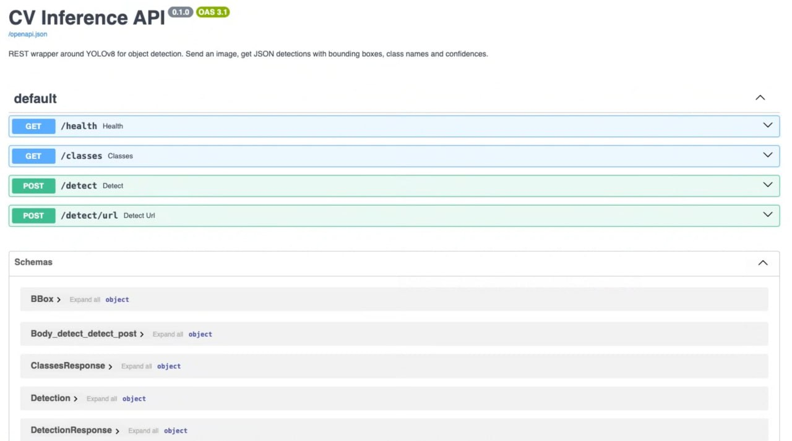

# ⚡ CV Inference API

Production-ready FastAPI service wrapping YOLOv8 for object detection. Send an image, get JSON detections — works for any system that can `POST` a file (web apps, n8n flows, mobile, Postman, `curl`).



> Swagger UI screenshot placeholder. After cloning, run the server and capture the `/docs` page.

---

## Why this project

Most ML repos hand you a notebook and stop. A real client wants something they can `curl`. This service is what you'd actually ship to their staging environment: typed Pydantic schemas, a `/health` for their load balancer, optional `X-API-Key` auth, CORS, configurable confidence and class filter, multipart **or** URL input, and a multi-stage Docker image with the model baked in.

---

## Endpoints

| Method | Path | Description |
|---|---|---|
| `GET` | `/health` | Liveness + active model + device |
| `GET` | `/classes` | All COCO class ids → names |
| `POST` | `/detect` | Multipart image upload → detections |
| `POST` | `/detect/url?url=…` | Detect from a public image URL |
| `GET` | `/docs` | Interactive Swagger UI |
| `GET` | `/redoc` | ReDoc reference |

All `POST` endpoints accept `?conf=0.5` and `?classes=person,car` query params.

---

## Quick start

```bash
git clone <this-repo>
cd cv-inference-api
python -m venv .venv && source .venv/bin/activate
pip install -r requirements.txt
cp .env.example .env  # optional — defaults work
uvicorn app.main:app --reload
```

Then:

```bash
curl -fsS http://127.0.0.1:8000/health
# {"status":"ok","model":"yolov8n.pt","device":"cpu"}

# Detect everything in an image
curl -s -X POST http://127.0.0.1:8000/detect \
     -F "file=@samples/street.jpg" \
     | jq '.detections[] | {class_name, confidence}'

# Only return people and cars, raise the threshold to 0.6
curl -s -X POST "http://127.0.0.1:8000/detect?conf=0.6&classes=person,car" \
     -F "file=@samples/street.jpg" \
     | jq '.detections | length'

# Equivalent using class ids instead of names (person=0, car=2)
curl -s -X POST "http://127.0.0.1:8000/detect?classes=0,2" \
     -F "file=@samples/street.jpg"

# Detect from a public URL (no upload)
curl -s -X POST "http://127.0.0.1:8000/detect/url?url=https://ultralytics.com/images/bus.jpg" \
     | jq '{count: (.detections | length), latency_ms}'

# With API key (when API_KEY is set in .env)
curl -X POST http://127.0.0.1:8000/detect \
     -H "X-API-Key: $API_KEY" \
     -F "file=@samples/street.jpg"
```

Or open http://127.0.0.1:8000/docs and use the Swagger UI directly.

### Example response

```json
{
  "request_id": "f8a4...",
  "model": "yolov8n.pt",
  "device": "mps",
  "image": {"width": 1920, "height": 1080, "resized_width": 1920, "resized_height": 1080},
  "detections": [
    {
      "class_id": 0,
      "class_name": "person",
      "confidence": 0.91,
      "bbox": {"x1": 612, "y1": 248, "x2": 745, "y2": 612}
    }
  ],
  "latency_ms": 23.47
}
```

---

## Benchmark — Apple M4 (10-core, 16 GB)

Real load test with `locust`, 4 concurrent users, 30 s, 640×640 JPEG payloads. Reproduce with `locust -f locustfile.py --host http://127.0.0.1:8000 --users 4 --headless -t 30s`.

| Device | p50 | p95 | p99 | throughput | failures |
|---|---:|---:|---:|---:|---:|
| **MPS (Apple GPU)** | **24 ms** | 42 ms | 63 ms | ~11 req/s | 0 |
| CPU | 41 ms | 86 ms | 140 ms | ~10 req/s | 0 |

Throughput is gated by the test's `wait_time` (0.1–0.5 s per user) — not by the API. Headroom on MPS is significantly higher; bump `--users` to find your saturation point on your hardware.

---

## Auth (optional)

Set `API_KEY=somelongsecret` in `.env`. Clients must then send `X-API-Key: somelongsecret`. Leaving `API_KEY` empty disables auth entirely.

```bash
curl -X POST http://127.0.0.1:8000/detect \
     -H "X-API-Key: somelongsecret" \
     -F "file=@photo.jpg"
```

---

## Docker

Multi-stage build, image ≈ 1.4 GB. Model weights baked in so first request is instant.

```bash
docker build -t cv-inference-api .
docker run --rm -p 8000:8000 cv-inference-api
```

Or with compose + `.env`:

```bash
docker compose up --build
```

The container runs CPU inference (Docker Desktop on macOS cannot pass through Apple GPU). On a CUDA host you can add the `--gpus all` flag and set `DEVICE=cuda`.

---

## Code layout

| File | Responsibility |
|---|---|
| [`app/main.py`](app/main.py) | FastAPI app, routes, CORS, API-key dependency |
| [`app/inference.py`](app/inference.py) | `ModelService` — loads YOLO once, handles resize + predict |
| [`app/schemas.py`](app/schemas.py) | Pydantic response models |
| [`app/config.py`](app/config.py) | `pydantic-settings`-driven env vars |
| [`tests/test_api.py`](tests/test_api.py) | 7 pytest cases: happy path, bad input, class filter |
| [`locustfile.py`](locustfile.py) | Load test scenario |
| [`Dockerfile`](Dockerfile) | Multi-stage CPU image |

---

## Tests

```bash
pytest tests/ -v
# 7 passed in ~35s (model load dominates)
```

---

## Design notes

- **Large images are downscaled** before inference (configurable via `MAX_IMAGE_SIDE`). Bounding boxes are scaled back to original-image coordinates in the response so clients never have to.
- **Singleton model** loaded inside FastAPI's `lifespan` context — no per-request reload, no cold starts after warm-up.
- **Failure modes are explicit**: 415 for non-image upload, 422 for empty / bad params, 502 for failed URL fetch, 401 for bad API key.

---

## License

MIT
